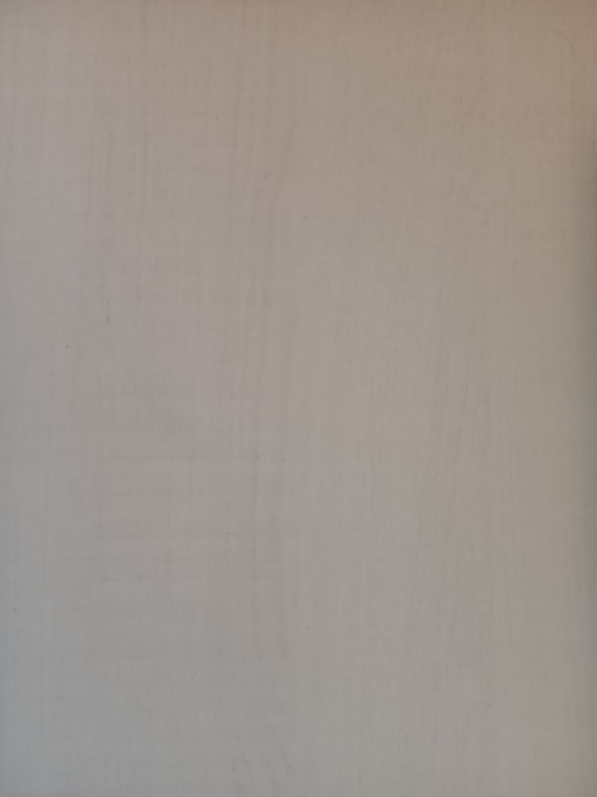
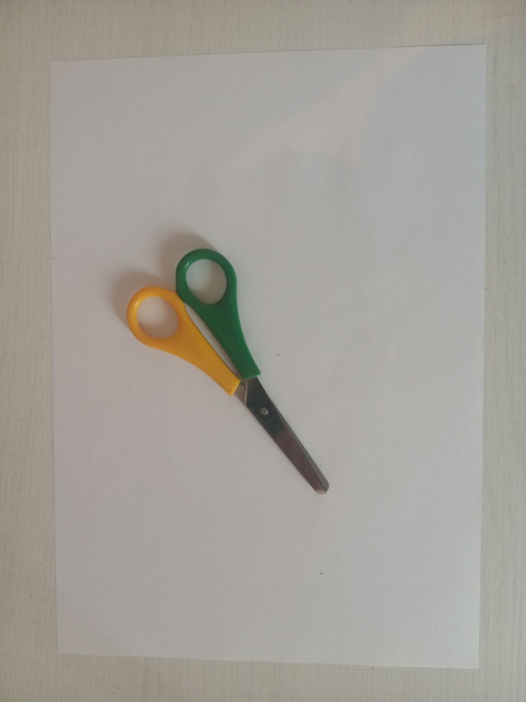
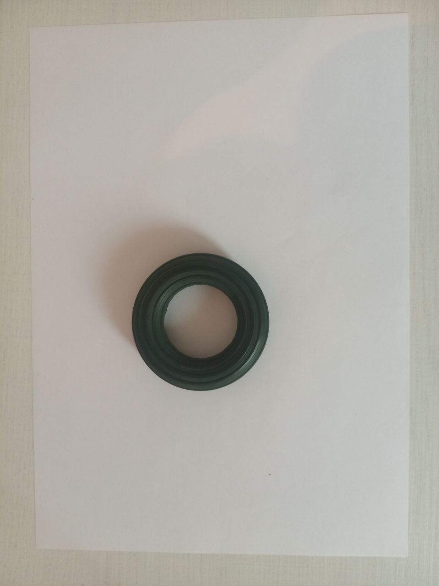
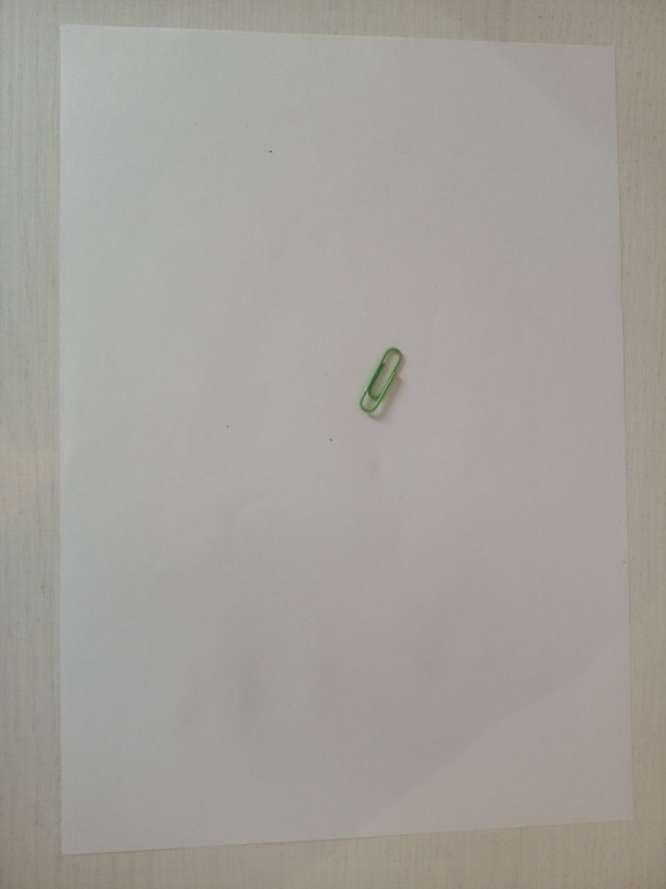
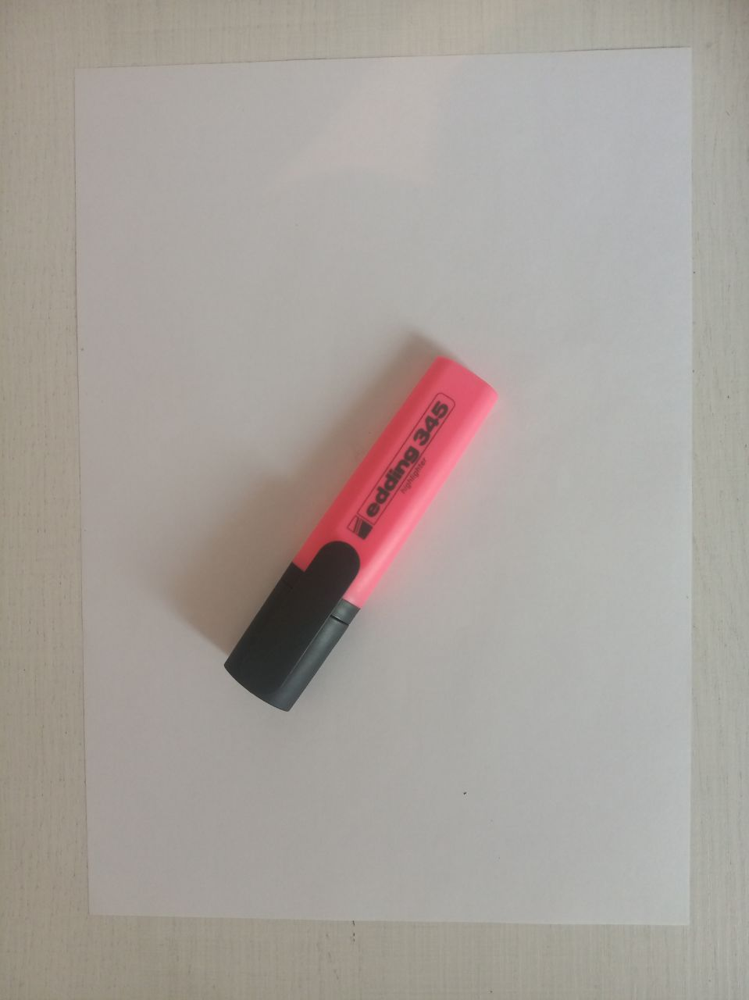
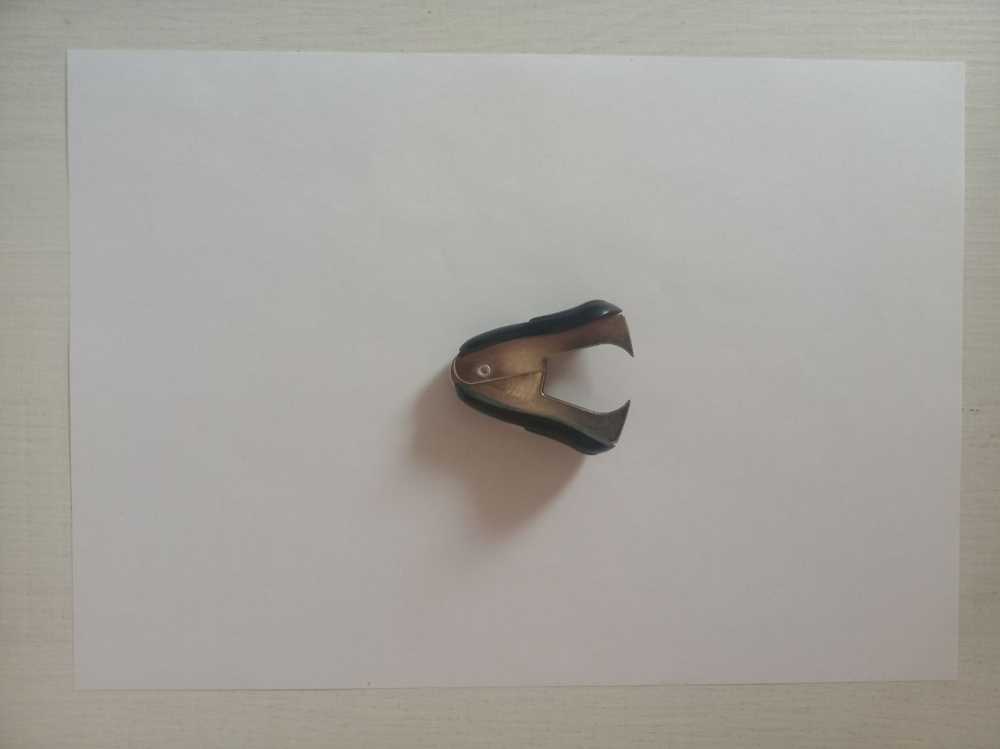
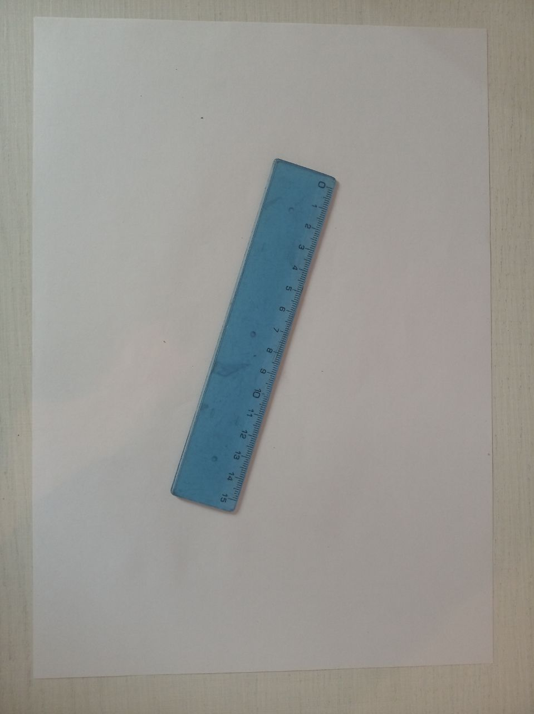
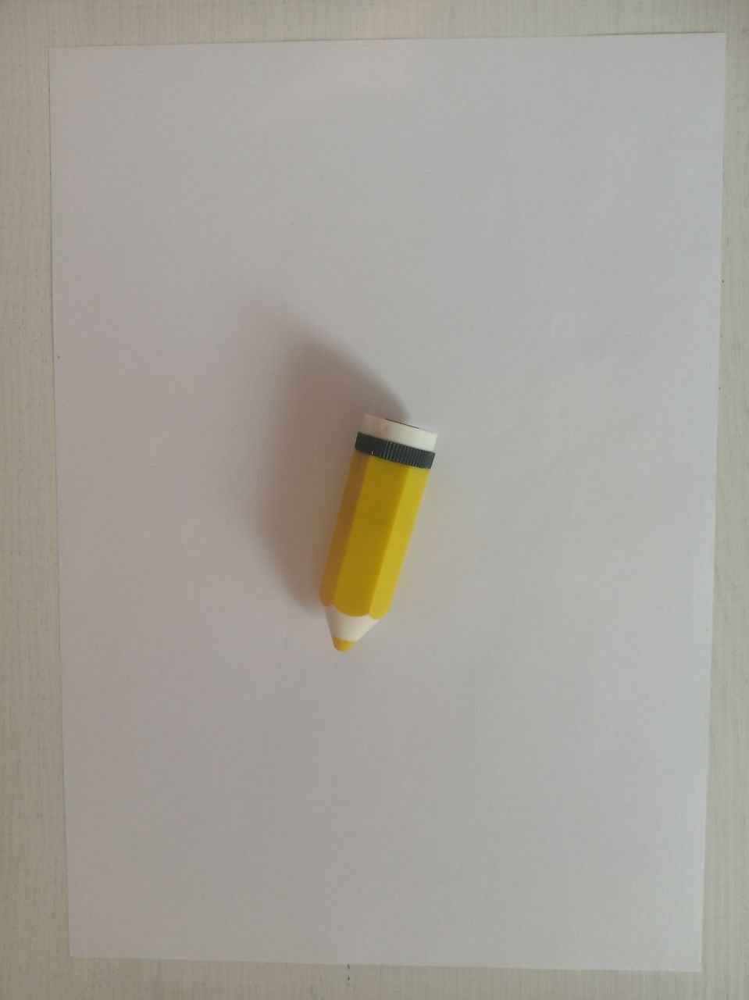

# Intelligent-Placer
## Постановка задачи
### Общее описание
В рамках данного проекта необходимо по поданной на вход фотографии нескольких предметов на светлой горизонтальной поверхности и многоугольнику понимать, можно ли расположить одновременно все эти предметы на плоскости так, чтобы они влезли в этот многоугольник.
### Выбор многоугольника
Многоугольник рисуется на белом листе формата А4 и фотографируется вместе с предметами.
### Алгоритм работы программы
На вход программа получает фотографию с несколькими предметами и белым листом формата А4, на котором изображён многоугольник. С помощью алгоритма программа решает, могут ли сфотографированные предметы влезть в нарисованный многоугольник. На выход программа отдаёт логическое значение:
+ *True* - если предметы могут влезть в многоугольник
+ *False* - в противном случае
### Требования
1. Фотометрические: угол наклона камеры 90 градусов, верхняя точка съёмки.
2. Расположение объектов на фотографии: объекты не могут перекрывать друг друга, могут быть расположены как в центре фотографии, так и на её границе, однако должны полностью помещаться на фотографии
3. Ограничение: число вершин многоугольника не должно быть больше 8
4. Один и тот же объект не может присутствовать на фото более одного раза.
## Поверхность

    

## Предметы
В качестве предметов были выбраны:

    
    Ножницы

    
    Эспандер

    
    Скрепка

    
    Флешка

    
    Маркер

    
    Антистеплер

    
    Линейка

    
    Точилка

    
    Клей-карандаш

    

     Блок стикеров

## Сбор данных
Тестовые изображения вместе с файлом разметки размещены [здесь](https://github.com/ITrosh/Intelligent-Placer/tree/develop/photos/test%20examples)

## План решения задачи
1. Используя алгоритм Canny, научиться определять границы предметов и многоугольника на тестовых изображениях.
2. Находить особые точки предметов на тестовом изображении и на шаблоне с помощью детектора Харриса и сопоставлять предметы на двух изображениях.
